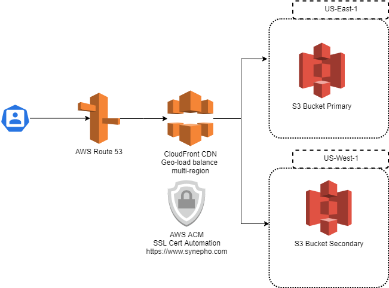

# My Terraform used to host https://www.synepho.com.

www.synepho.com my personal branding site hosting context I created using GatsbyJS, a REACT based framework. While I could have simply hosted this site on something like Vervel of Netlify, I wanted to create my own production grade hosting platform that I can fully manage and control.

## AWS Resources used include;

R53 | IAM | S3 | CloudFront | ACM | Cloudwatch | Glacier |

## Diagram of the Platform

